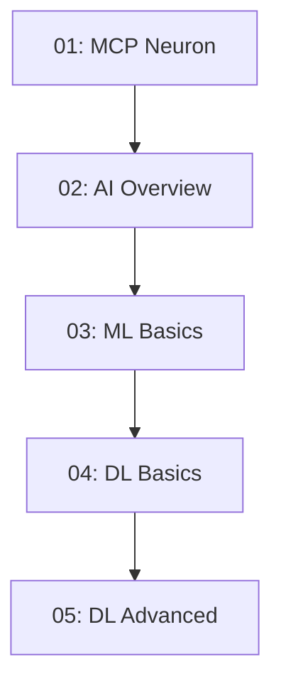
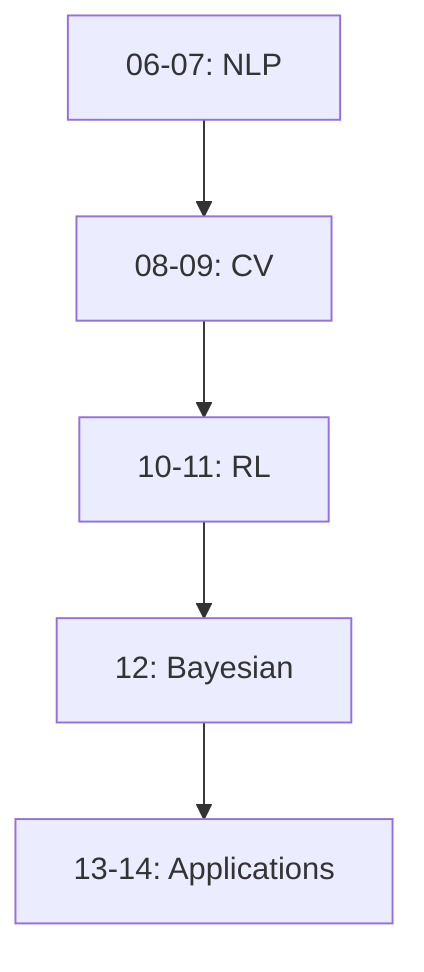
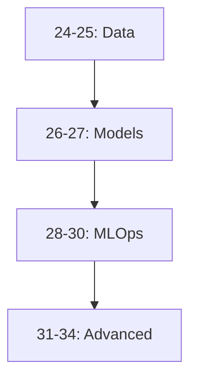

# 🧭 Repository Navigation Guide
## Complete File Structure and Navigation

*"Navigate your ML learning journey with confidence"*

---

## 📋 File Naming Conventions

### 📚 Course Content Files
- Format: `XX_descriptive_name.md`
- Example: `01_mcp_neuron.md`
- Numbering: Two-digit sequential (01-99)
- Separator: Underscore (_)
- Case: Lowercase with underscores

### 📊 Documentation Files
- Format: `UPPERCASE_WITH_UNDERSCORES.md`
- Example: `CONTENT_STATUS_REPORT.md`
- Case: All uppercase
- Special files: `README.md`, `index.md`

### 🎨 Asset Files
- Format: `category_descriptive_name.extension`
- Example: `diagram_neural_network.png`
- Categories: `diagram_`, `code_`, `image_`
- Case: Lowercase with underscores

---

## 🔄 Cross-Reference System

### 🔗 Internal Links
- Use relative paths: `[Link Text](../path/to/file.md)`
- Example: `[Neural Networks](../foundations/01_mcp_neuron.md)`

### 📚 External References
- Format: `[Resource Name](https://external.link)`
- Papers: Include year and authors
- Tools: Include version numbers

### 🏷️ Topic Tags
- Format: `#topic-name`
- Core tags: `#ml-basics`, `#deep-learning`, `#nlp`, `#computer-vision`
- Status tags: `#complete`, `#in-progress`, `#todo`

---

## 📁 Repository Structure

```
Learn_ML/
├── 📚 docs/                          # Documentation and reports
│   ├── 📊 progress/                  # Progress tracking
│   │   ├── FINAL_NUMBERING_REPORT.md
│   │   ├── numbering_analysis.md
│   │   ├── numbering_fix_summary.md
│   │   └── fix_numbering_plan.md
│   └── 📋 planning/                  # Organization plans
│       └── ORGANIZATION_PLAN.md
├── 🎯 course/                        # Main course content
│   ├── 📖 foundations/               # 01-05: AI/ML Basics
│   ├── 🧠 core_ml_fields/           # 06-14: Core ML Concepts
│   ├── 🔬 specialized_ml/           # 15-23: Specialized Topics
│   ├── ⚙️ ml_engineering/           # 24-34: ML Engineering
│   ├── 🛠️ tools_and_ides/          # 35-42: Development Tools
│   ├── 🤖 llms_and_ai_models/       # 43-51: LLMs & AI Models
│   ├── 🏗️ infrastructure/           # 52-55: Infrastructure
│   ├── 🚀 advanced_topics/          # 56-64: Advanced Research
│   ├── 🔒 ai_security/              # 65-66: AI Security
│   ├── 🌍 domains_and_applications/ # 67-79: Industry Applications
│   ├── 💼 projects_and_practice/    # 80-87: Hands-on Projects
│   └── 🏆 capstone/                 # 88-100: Capstone Projects
├── 📁 assets/                        # Images, diagrams, code examples
│   ├── 📊 diagrams/                 # Architecture & flow diagrams
│   ├── 💻 code_examples/            # Code snippets & demos
│   └── 🎨 images/                   # Illustrations & screenshots
├── 🎯 README.md                      # Main landing page
├── 📚 index.md                       # Course overview
└── 📋 .gitignore                     # Git ignore file
```

---

## 📈 Progress Tracking

### 🎯 Status Indicators
- ✅ **Complete**: Ready for use
- 🔄 **In Progress**: Being updated
- 📝 **Draft**: Initial content
- 🚫 **Todo**: Not started

### 📊 Completion Metrics
- **Lines of Content**: Actual content lines
- **Code Examples**: Number of examples
- **Exercises**: Practice problems
- **Projects**: Hands-on projects

[Previous content with file listings remains the same...]

---

## 🗺️ Prerequisites Map

### 📚 Foundations Track


### 🧠 Core ML Track


### ⚙️ Engineering Track


---

## 🚀 Quick Access Links

### 🎯 Start Here
- **[Main README](README.md)** - Course overview
- **[Course Index](index.md)** - Complete syllabus
- **[Foundations](course/foundations/)** - Begin learning

### 📚 Documentation
- **[Progress Reports](docs/progress/)** - Status tracking
- **[Planning Documents](docs/planning/)** - Organization
- **[Navigation Guide](NAVIGATION.md)** - This file

### 🎓 Learning Paths

#### Beginner Path
1. [Foundations](course/foundations/) → 2. [Core ML Fields](course/core_ml_fields/) → 3. [Specialized ML](course/specialized_ml/)

#### Engineering Path
1. [ML Engineering](course/ml_engineering/) → 2. [Tools & IDEs](course/tools_and_ides/) → 3. [Infrastructure](course/infrastructure/)

#### AI Models Path
1. [LLMs & AI Models](course/llms_and_ai_models/) → 2. [Advanced Topics](course/advanced_topics/) → 3. [AI Security](course/ai_security/)

#### Applications Path
1. [Domains & Applications](course/domains_and_applications/) → 2. [Projects & Practice](course/projects_and_practice/) → 3. [Capstone](course/capstone/)

---

## 📊 Repository Statistics

- **📚 Total Files**: 100 comprehensive markdown files
- **📝 Total Content**: 400,000+ words of detailed ML content
- **🎯 Coverage**: Complete ML engineering stack from foundations to frontier
- **🔄 Updates**: 2025-relevant trends and technologies
- **💻 Code Examples**: Production-ready implementations
- **🎓 Projects**: Hands-on exercises and portfolio-building projects
- **📈 Career Focus**: Certification paths and professional development

---

*"The best way to navigate complexity is with clear structure and systematic organization."*

**Ready to explore? Start with [Foundations](course/foundations/) or check the [Main README](README.md)!**